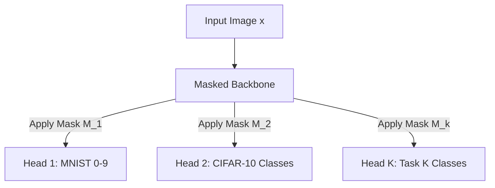

# Continual Learning via Dynamic Activity-Dependent Pruning (DADP)
**A Formal Proposal for Sequential Task Packing**

This document formalizes the idea of using **Dynamic Activity-Dependent Pruning (DADP)** as a parameter-isolation mechanism for **Continual Learning (CL)** / **Lifelong Learning**. It explores the feasibility, details the mathematical formulation, addresses the output layer conflict, and highlights the key advantages of this method over standard approaches.

---

## 1. Concept Feasibility & Context

**Yes, this idea is highly interesting, theoretically sound, and very possible to implement.** 

In Continual Learning (CL), the primary bottleneck is **Catastrophic Forgetting**—where training a model on Task $B$ overwrites the features learned for Task $A$. Your idea belongs to the family of **Parameter Isolation (or Architecture-based) Methods**. 

Famous papers in this category include:
*   **PackNet** (Mallya & Lazebnik, CVPR 2018): Uses post-hoc magnitude pruning to pack multiple tasks into a single network.
*   **HAT (Hard Attention to the Task)** (Serrà et al., ICML 2018): Learns attention masks over activations to isolate task pathways.
*   **Supermasks in Superposition** (Wortsman et al., NeurIPS 2020): Learns binary masks over fixed random weights.

### The DADP Advantage
Traditional methods like **PackNet** require a slow, three-step cycle for each task: **Train (dense) $\rightarrow$ Prune (post-hoc) $\rightarrow$ Retrain (sparse)**. 
By integrating **DADP**, we can prune **dynamically during training in a single pass**. This eliminates the retraining phase entirely, making sequential task packing highly efficient and biologically plausible (developmental synapse elimination during the learning process).

---

## 2. Mathematical Formalization

Let the base neural network have parameters $W \in \mathbb{R}^D$.
We train the model on a sequence of $K$ tasks: $\mathcal{T}_1, \mathcal{T}_2, \dots, \mathcal{T}_K$. For each task $k$, we want to find a subnetwork represented by a binary mask $M^{(k)} \in \{0, 1\}^D$.

We define the set of parameters claimed by all prior tasks ($1$ to $k-1$) as:
$$M^{\text{claims}}_{<k} = \bigvee_{j=1}^{k-1} M^{(j)} \quad \text{(element-wise OR)}$$

There are two primary paradigms to formalize the weight allocation:

### Scheme A: Strict Disjoint Partitioning (No Feature Sharing)
Each task uses entirely distinct parameters. 
*   **Optimization Space:** The parameters available for learning task $k$ are restricted to the unused weights: $W \odot (1 - M^{\text{claims}}_{<k})$.
*   **Forward Pass:** 
    $$y = f(x; W \odot M^{(k)})$$
*   **Backward Pass & DADP:** We optimize and apply DADP *only* to the parameters in $1 - M^{\text{claims}}_{<k}$. At the end of Task $k$'s training, the surviving connections form $M^{(k)}$, which is added to $M^{\text{claims}}_{<k+1}$.
*   **Pros:** Zero interference between tasks.
*   **Cons:** No forward transfer. Task $k$ cannot reuse low-level features (e.g., edges, textures) learned in previous tasks.

### Scheme B: Read-Only Feature Sharing (Forward Transfer)
To allow Task $k$ to leverage features learned by prior tasks without altering them.
*   **Forward Pass:** Task $k$ utilizes both the frozen parameters of previous tasks and its own allocated parameters:
    $$y = f(x; W \odot (M^{\text{claims}}_{<k} \cup M^{(k)}))$$
*   **Backward Pass:** Gradients are only computed and applied to the newly allocated weights $M^{(k)} \subseteq (1 - M^{\text{claims}}_{<k})$. The gradients for previously claimed parameters are explicitly zeroed out:
    $$\nabla_{W \odot M^{\text{claims}}_{<k}} \mathcal{L}_k = 0$$
*   **DADP Application:** DADP tracks the expected Gradient $\times$ Activation metric *only* for the active parameters inside $M^{(k)}$.
*   **Pros:** Encourages **positive forward transfer** (Task $k$ can build on top of Task $1 \dots k-1$), meaning Task $k$ will require even fewer parameters (higher sparsity).
*   **Cons:** Slightly more complex gradient masking.

---

## 3. Resolving the Output Layer Conflict

You correctly identified a fundamental challenge: **How do we handle the output layer?** If both MNIST and CIFAR-10 have 10 classes, using the exact same output neurons causes a head-on collision. 

In Continual Learning, this is solved by choosing between two learning settings:

### Option 1: Multi-Head Output (Task-Incremental Learning - Task-IL)
This is the most common setting for parameter isolation. 
*   **Architecture:** The shared backbone (convolutional and hidden linear layers) uses masked pathways. However, instead of a single output layer, the network has $K$ independent output heads $H^{(1)}, H^{(2)}, \dots, H^{(K)}$, each mapping the final hidden layer representation $h$ to the task's specific classes (e.g., $H^{(k)}: \mathbb{R}^{d_{\text{hidden}}} \rightarrow \mathbb{R}^{10}$).
*   **Inference:** During evaluation, you must provide the Task ID $k$. You apply mask $M^{(k)}$ to the backbone, and read the logits from head $H^{(k)}$.
*   **Why it works:** It is highly effective and completely prevents output interference.

### Option 2: Single-Head Output + Task Inference (Class-Incremental Learning - Class-IL)
If the Task ID is **not** provided at inference time, the model must dynamically route the input and classify it among all $10 \times K$ classes.
*   **Architecture:** We still maintain separate output heads $H^{(k)}$ (or a single growing output layer), but we need a mechanism to predict the task ID.
*   **Entropy-Based Task Inference:** 
    1. Pass the input $x$ through the network $K$ times, each time applying the mask $M^{(k)}$ and outputting logits from $H^{(k)}$.
    2. Compute the softmax probability distribution $p^{(k)}$ for each run.
    3. Calculate the entropy (or maximum prediction confidence) of each distribution:
       $$\text{Confidence}(k) = \max_c p^{(k)}_c$$
    4. Select the prediction from the task that produces the highest confidence:
       $$k^* = \arg\max_k \left( \max_c p^{(k)}_c \right)$$
*   **Why it works:** Out-of-distribution inputs (e.g., passing a CIFAR-10 image through the MNIST mask/head) typically result in highly uncertain, low-confidence predictions. The correct mask will yield a sharp, high-confidence output.

---

## 4. Potential Challenges & Open Questions

While highly promising, you should consider the following details in your formal design:

1.  **Sparsity Exhaustion (Network Capacity):**
    As you add more tasks, the available capacity decreases ($98\% \rightarrow 95\% \rightarrow 92\% \dots$). Eventually, the network runs out of parameters. 
    *   *Solution:* Introduce dynamic network expansion (e.g., adding a small percentage of new channels/filters when the available capacity falls below a threshold).
2.  **Hebbian Tracking Variables:**
    DADP tracks expected importance over time using moving averages:
    $$\hat{I}_{ij} = (1 - \alpha)\hat{I}_{ij} + \alpha \left| a_i \cdot \frac{\partial \mathcal{L}}{\partial y_j} \right|$$
    When transitioning from Task $k$ to Task $k+1$, you must **reset or freeze** the tracking variables $\hat{I}$ for the frozen parameters so that the gradients from the new task do not corrupt the importance metrics of previous tasks.
3.  **No Backward Transfer:**
    Since parameters for Task $1 \dots k-1$ are strictly frozen, learning Task $k$ cannot improve the performance of previous tasks. This is a common trade-off in parameter-isolation methods (in exchange for absolute protection against catastrophic forgetting).
